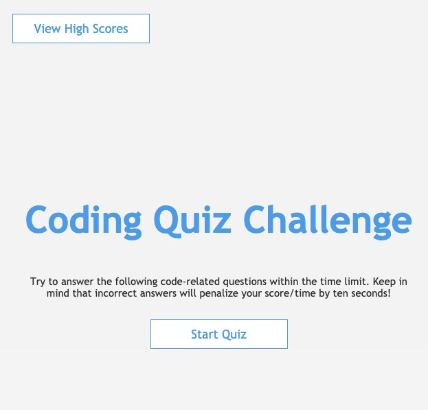

Coding Quiz

* In this timed quiz, the user gains 10 points when they answer correctly, and 10 seconds come off of the timer when they answer incorrectly.
* The top 5 scores are saved in Local Storage

Languages used
* HTML
* CSS
* Javascript

[Coding Quiz!](cassie-s.github.io/code-quiz)
